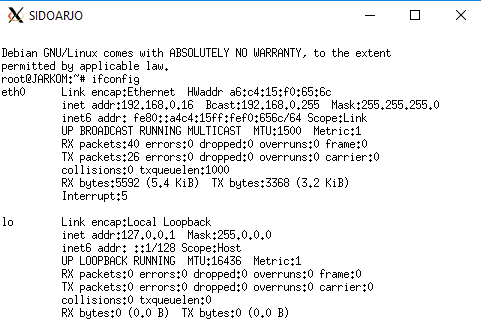
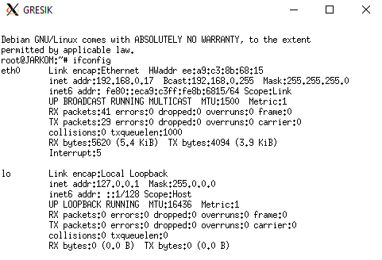
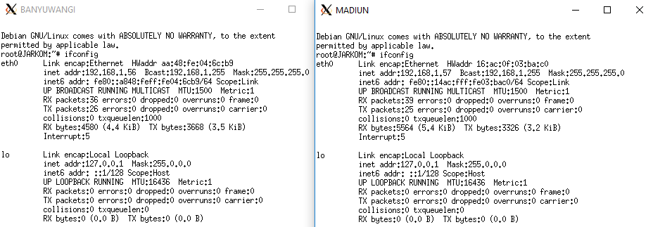
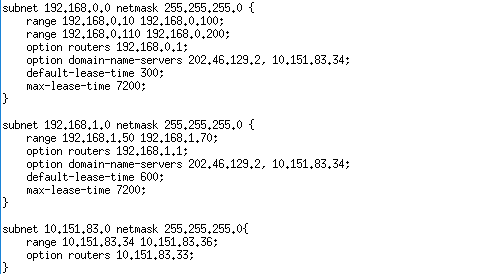
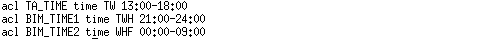
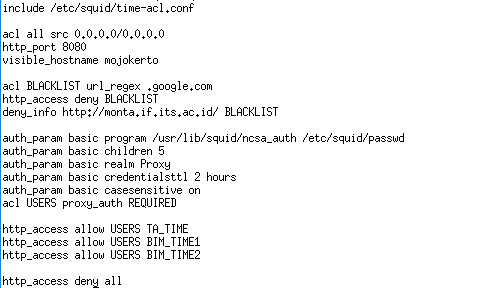

# Jarkom_Modul3_Lapres_B03

### 1. Membuat topologi jaringan 
- Surabaya: Router
- Malang: DNS Server
- Tuban: DHCP Server
  - Install `isp-dhcp-server`
  - Konfigurasi DHCP server 
- Mojokerto: Proxy Server
  - Install squid pada UML Mojokerto
  - Konfigurasi Squid
- UML lain: Client 
  - Konfigurasi DHCP client (Gresik, Sidoarjo, Banyuwangi, Madiun)

### 2. SURABAYA ditunjuk sebagai perantara (DHCP Relay) antara DHCP Server dan client.
- Install `isp-dhcp-relay` di Surabaya
- Set IP DHCP ke tuban
- Set interface menjadi eth1 eth2 eth3

### 3. Client pada subnet 1 mendapatkan range IP dari 192.168.0.10 sampai 192.168.0.100 dan 192.168.0.110 sampai 192.168.0.200.
- Konfigurasi `range 192.168.0.10 192.168.0.100`
- Konfigurasi `range 192.168.0.110 192.168.0.200`

### 4. Client pada subnet 3 mendapatkan range IP dari 192.168.1.50 sampai 192.168.1.70.
- Konfigurasi `range 192.168.1.50 192.168.1.70`

### 5. Client mendapatkan DNS Malang dan DNS 202.46.129.2 dari DHCP 
- `option domain-name-servers 202.46.129.2, 10.151.83.34`

### 6. a) Client di subnet 1 mendapatkan peminjaman alamat IP selama 5 menit
- Konfigurasi `default-lease-time 300`

### 6. b) Client pada subnet 3 mendapatkan peminjaman IP selama 10 menit.
- Konfigurasi `default-lease-time 600`

### 7. User autentikasi milik Anri memiliki format:
#### - User : userta_b03
#### - Password : inipassw0rdta_b03

- Install `apache2-utils` pada proxy server
- Buat user `userta_b03` dengan password `inipassw0rdta_b03`

### 8. Membatasi penggunaan internet hanya pada jadwal yang telah ditentukan (setiap hari Selasa-Rabu pukul 13.00-18.00)
- Menggunakan `acl TA_TIME time TW 13:00-18:00`
- `http_access allow users TA_TIME`

### 9. Setiap hari Selasa-Kamis pukul 21.00 - 09.00 keesokan harinya (sampai Jumat jam 09.00).
- `acl BIM_TIME1 time WHF 00:00-09:00`
- `acl BIM_TIME2 time TWH 21:00-23:59`
- `http_access allow users BIM_TIME1`
- `http_access allow users BIM_TIME2`

### 10. Setiap mengakses `google.com`, maka akan di redirect menuju `monta.if.its.ac.id`
- `acl BLACKLIST url_regex google.com`
- `http_access deny BLACKLIST`
- `deny_info http://monta.if.its.ac.id/ BLACKLIST`

### 11. Mengubah error page default squid
- Mengganti `ERR_ACCESS_DENIED` file di `usr/share/squid/errors/en` menjadi file yang telah di download

### 12. Ketika menggunakan proxy cukup dengan mengetikkan domain janganlupa-ta.b03.pw dan memasukkan port 8080.
- Domain `http://janganlupa-ta.b03.pw` diatur DNS di Malang dan mengarah ke IP Tuban (`10.151.83.36`)

